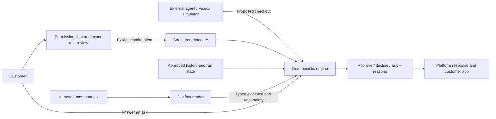

# Leash

**Let the agent do the shopping. Keep the permission with the person.**

Our entry for Viseca's **Agent on a Leash** challenge at Swiss {ai} Weeks 2026.

A purchase can fit a budget and still be wrong: a substituted product, an unwanted subscription, a second order, or terms the customer never accepted. Leash is a wallet control layer that checks each proposed purchase against the customer's confirmed permission, explains its decision, and remembers what has already happened.

We are building the permission and payment-control journey. An external shopping agent finds products and prepares orders; Viseca's simulator plays that role in the challenge.

**Status · 25 September 2026:** working proof of concept with a React customer app, permission assistant, deterministic engine, durable ledger and simulator integration. Local journey evidence and a completed hosted validation run are linked below. Model calibration, independently reviewed acceptance data and production authentication remain open.

[Try it locally](#run-the-demo) · [Evidence and benchmarks](#what-we-measured) · [Complete benchmark archive](docs/benchmarks.md) · [Training lessons](#what-training-taught-us) · [Product direction](#where-we-want-to-take-it)

## What we want to demonstrate to the jury

**Useful delegation with understandable boundaries.** The customer should not have to inspect every compliant purchase. They should be able to see what they allowed, understand an intervention, and stop further spending.

Consider a permission for one chosen monitor, up to CHF 400, with no paid extras:

- **Approve:** the checkout meets the confirmed rules. No second confirmation is needed.
- **Decline:** the checkout exceeds CHF 400 or violates another hard rule. A merchant's claim that the customer authorised CHF 900 cannot raise the limit.
- **Ask the customer (`step_up`):** a required fact is uncertain under an ask policy, or a duplicate or split order needs attention. The purchase waits; it has not been counted as approved spend.

The explanation shows the relevant permission, checkout evidence and reasons. A customer answer cannot override a hard-rule violation.

Our intended value for Viseca is a customer control experience suitable for integration into **one**, backed by an independently deployable decision service. The customer manages permission; the engine checks actual checkouts; the platform reports whether it accepted the decision.

## From a wish to a controlled purchase

This is our intended end-to-end flow. The evidence below distinguishes implemented controls from checks still awaiting validation, including permission verification in shadow mode.

1. **The customer describes the task in Leash's chat.** Gemini helps extract proposed permissions and asks about missing context. It cannot activate permission or approve purchases.
2. **Background data helps clarify intent.** Preferences and transaction history can suggest relevant questions: “You usually avoid substitutions—apply that here?” A habit or inferred preference does not automatically become authority.
3. **We check the proposed permission.** Every rule must be supported by the customer's instructions or explicit answers and express something the engine can enforce. We check for invented conditions, contradictions and omitted restrictions. Unclear product references or unverifiable requirements need clarification. Jev's support and omission checks remain in shadow mode pending reviewed calibration; they are not a proven guarantee that every restriction is captured.
4. **The customer reviews and confirms in the app.** **Must follow / May choose / Must ask** is derived from the exact rules we will enforce. Customers can correct unconfirmed drafts; changes create a new revision and require fresh review and confirmation. Chatting “yes” does not activate spending permission.
5. **The external shopping agent receives the task and confirmed boundaries.** It receives a permission reference; authoritative permission stays with Leash and the platform, and the agent cannot expand it. Viseca's simulator represents the external agent in the challenge and binds each run to its mandate snapshot.
6. **Leash validates each actual checkout attempt.** It compares the checkout, confirmed permission and relevant history. Deterministic checks produce approval, decline or a request for customer input. Merchant text cannot override permission, and missing evidence must not silently become a match. Customers can answer asks, tighten permission or revoke it, subject to the platform's run-snapshot semantics.
7. **We preserve evidence and report the actual outcome.** We connect the conversation, confirmed permission version, checkout, checks and platform response. The app distinguishes a local decision, pending delivery, platform acceptance and a conflicting outcome. A local approval is not a completed payment; even platform acceptance is not proof of settlement or delivery of the goods.

## How the control layer works



**Rules decide, models advise.** Gemini proposes permission rules; code validates and renders them for customer confirmation. Jev reads merchant text and separately observes permission support and omissions. Neither model can activate a mandate or issue an authoritative payment verdict.

The engine's core is a pure function: `decide(purchase, mandate, state_snapshot, facts)`. It checks spending limits, merchant requirements, item identity and quantity, fulfilment, sizes, returns, extras and relevant history. The most restrictive result wins: `decline > step_up > approve`.

The implementation makes the payment details explicit:

- **Exact money and meaningful time.** Decimal arithmetic, half-even cent rounding and conversion using the purchase currency. Simulated purchase time drives rolling windows; wall time governs response deadlines.
- **State that survives retries.** Only final approvals consume spending limits. Live authorization IDs prevent double counting. Per-card database locks, an append-only event log and a transactional outbox protect decisions and delivery.
- **Authority stays at the boundary.** The live event's structured mandate governs the purchase. Merchant text cannot edit it. Unsupported rules and missing facts are handled explicitly; integrity protections can force attention even under a permissive uncertainty policy.
- **Bounded failure handling.** The worker budgets against the platform's deadline, normally eight seconds from queueing, with a watchdog for a safe response. The current Jev reader uses a one-second per-phase HTTP timeout within that overall budget; failed or ambiguous reads request customer confirmation. It has no regex fallback. Regex remains an explicit offline baseline.
- **Evidence without invented certainty.** Jev scans merchant and item text, including a normalized Unicode view. Model-only size and return claims cannot erase structured-evidence uncertainty. A merchant claim or plausible catalogue price is not proof of product quality or merchant honesty.

The backend uses **Python 3.12, FastAPI, Pydantic v2, asyncpg and Postgres 17**. The app uses **React, TypeScript and Vite**, with server-sent events for updates. Current model configuration is **Gemini 3.8 Flash through OpenRouter** for drafting and **Jev** for reading; permission verification defaults to **shadow mode**, where findings do not block drafts.

[Architecture and failure handling](docs/system-design.html) · [Decision log and assumptions](docs/decisions.md) · [Operational runbook](RUNBOOK.md)

## What we measured

These results answer different questions: does the engine behave consistently, can a model read the evidence, and does the application deliver a decision? **The supplied 45 purchases have no official expected verdicts. Their replay is not an accuracy score.** Authored model diagnostics are also not independently reviewed production benchmarks.

The [complete benchmark archive](docs/benchmarks.md) links every existing result report, including raw predictions, latency, calibration, failed experiments and journey diagnostics. Gemini/Jev are our current models; Laya/Apertus results remain historical comparisons. Experiment plans are listed separately from measured results. No benchmarks were rerun for this documentation update.

### Deterministic replay and integration

The recorded reference evaluation replayed all **45 purchases three times with identical results**: **12 approve, 11 ask, 22 decline**. It exercised all **13 rule fields** advertised by that evaluated registry and recorded **17 reason codes**. These are the historical regex/hand-compiled-mandate baseline, not fresh measurements of today's full Jev path.

We also measured how team assumptions affect outcomes. Removing the interpretation of “a shop I use regularly” changed **7 of 45** verdicts. That makes a product assumption visible for discussion with Viseca instead of presenting it as an official answer.

[Replay report](../output/scenario-evaluation-2026-09-25.md) · [Decision-layer comparison](../output/decision-layer-eval-fast.md)

The local browser journey recorded an ordinary **CHF 20 purchase approved and accepted**, linked from conversation revision through permission to checkout. A separate ten-checkout household run verified rolling-window expiry. These runs used the earlier Apertus configuration.

The later hosted Viseca validation completed **2 of 2 checkouts**, with no pending events or platform rejections. The platform recorded one approval with a human-confirmation marker and one engine decline. The decline was recorded about **0.77 seconds after queueing**. Recovery and a repeated Start returned the existing run. This proves connectivity, delivery and recovery for that run; it does not independently authenticate the person behind the platform's human marker or establish complete journey acceptance.

[Local journey evidence](../output/local-simulation-verification.md) · [Hosted validation, fixes and limits](docs/live-journey-validation.md)

### Permission drafting and merchant-text reading

On **16 authored permission cases, each run twice**, the recorded comparison was:

- **Gemini:** **32/32** passes; median **1.147 s**, p95 **1.540 s**.
- **Gemini with enforcing Jev verification:** **29/32**; median **1.438 s**, p95 **1.842 s**. Three correct readings were rejected. This experimental enforcement is not the current shadow configuration.
- **Apertus:** **24/32**; median **1.228 s**, p95 **59.610 s**.
- **Deterministic compiler:** **12/32**; median **0.20 ms**, p95 **0.35 ms**.

This informed our drafting choice; two repeats are not 32 independent cases. These are application comparisons using each adapter's prompt and validation, not an identical-prompt model leaderboard.

On **24 authored merchant texts, each run twice**, the earlier four-flag reader comparison was:

- **Jev:** targeted condition correct in **44/48** trials; all four flags correct in **34/48**; median **299 ms**, p95 **596 ms**.
- **Jev + regex:** targeted condition **43/48**; all four flags **33/48**; median **303 ms**, p95 **501 ms**. No fallback occurred in these trials. This historical merge is no longer the current reader.
- **Regex:** targeted condition and all four flags **16/48**; median **0.22 ms**.

Some cross-label disagreements are ambiguous; the reports retain both scoring methods and every prediction. False alarms matter because unnecessary interruptions defeat delegation.

Those timings do **not** measure the expanded reader now used by the app. Its subsequent diagnostics passed **9/12** on the first run, **1/3** when rechecking failures, and **7/12** in reverse order, with transport failures. The two still-unread inputs passed **2/2** with a five-second diagnostic timeout, taking **5.63 s** and **2.12 s** overall. All expected outcomes were observed across runs, but no single production-budget run passed all twelve. Reliable reader latency remains an open validation item.

Later hardening probes exercised invented size/return facts, ambiguous injection scores and hostile merchant text. The permission-support/omission diagnostic contains **four synthetic cases**, **zero human-reviewed examples**, and `release_ready: false`. These are targeted guardrail checks, not a measured attack-resistance or omission-prevention rate. [All Jev diagnostic reports](docs/benchmarks.md#gemini-and-jev-results).

[Benchmark methods, raw reports and reproduction](docs/openrouter-benchmark.md)

### Why payment decisions remain deterministic

We tested Apertus as an independent payment assessor and as an adviser given the engine's checks. On **12 authored controls**, the engine matched **9/12**, independent Apertus **4/12**, and Apertus with engine checks **6/12**. The guarded advisory added no successful intervention on those controls. The engine itself missed two semantic cases, so this was evidence of gaps in both approaches.

The model sometimes overlooked accumulated spending or softened an explicit limit violation into a question. Initial research runs also showed p95 call times around **59–61 seconds**, including retries—unsuitable for the checkout deadline. These findings apply to that tested model and setup, not every reasoning model.

[Decision-boundary experiment and exact failures](docs/ai-decision-experiment.md)

## What training taught us

We built separate **shop-text** and **permission-verification** experiments around Laya. Reading a listing and checking whether a proposed permission follows from a conversation need different labels and evaluation. The data work includes English, German, French and Italian examples, attack/benign pairs, source provenance, family-aware splits, token-length checks, checkpoint hashes and calibration reports. Draft synthetic labels remain explicitly unreviewed.

**Training gains need a second kind of test.** Shop-v2 trained on an A100 in **322 seconds**, using about **6.05 GiB** peak GPU memory. Injection recall rose from **50.9% to 94.4%** on the original 216-case development slice, and from **28.3% to 96.7%** on 120 listing-based attack/benign examples, with zero observed false flags in those v2 slices. Yet the later 24-case application diagnostic still missed **all four paraphrased add-ons** and caught only **two of four payment-steering examples**. Strong results on template-based development data did not establish generalization.

**Correct wiring is separate from model quality.** The historical Laya worker test delivered all 45 purchases through Postgres to the fake platform before deadline, with p95 **0.865 seconds** and duplicates counted once. The same checkpoint still failed semantic quality checks. We also found that matching the inference input to the training format changed results without changing weights.

**Calibration cannot repair a wrong interpretation.** Permission experiments tracked false support, omissions, necessary questions and needless questions separately. Adding scenario examples in v5 increased development false support from **51/112 to 61/112** and reduced omission detection from **36/54 to 34/54**, despite improved calibration metrics. Later v6/v7 experiments retained explicit failed improvement criteria and `release_ready: false` reports.

**A verifier must earn the right to block.** In separate Jev controls at threshold 0.9, it rejected all six deliberately wrong rules **and all six valid rules**. Enforcing verification also reduced Gemini's drafting result from **32/32 to 29/32**. We therefore keep permission verification in shadow mode while collecting reviewed calibration and evaluation evidence.

Our learning is practical: evaluate both missed restrictions and unnecessary friction, retain failed experiments, and require evidence before promoting a model. **No Laya checkpoint from these experiments is the current deployed reader.**

[Training record and data methods](training/README.md) · [Laya application evaluation](docs/laya-system-evaluation.md) · [v6 results](training/reports/laya-permission-v6-experiment-summary.json) · [v7 results](training/reports/laya-permission-v7-experiment-summary.json)

## Our conclusion

**Connecting the customer's original intent to the actual checkout is the path to more control over an AI shopping agent.** The initial request tells us what the customer wants; the confirmed permission makes the boundaries explicit; checkout information shows what the agent is actually proposing to buy. Comparing those three, together with earlier approved purchases, lets Leash identify where the order departs from the permission and explain why it should proceed, stop or wait for the customer.

That comparison needs the details of the purchase: the item, quantity, total price, extras and relevant terms. A budget alone cannot tell us whether the agent bought the intended product or added a subscription. Merchant claims remain untrusted evidence, and unknown details must stay visible as uncertainty.

**This is how we put a leash on the agent: keep the customer's confirmed boundaries attached to every checkout, with an explanation and a record of the outcome.** Our experiments reinforce that the model can help interpret language, while customer confirmation establishes permission and deterministic code enforces it.

## Where we want to take it

Our product direction is to keep **customer intent, confirmed permission and the actual checkout consistent over time**, and preserve the evidence explaining any difference. An issuer should be able to trace what the customer allowed, what the agent attempted, which rule applied, and what the platform accepted.

The longer-term **TaskCard** idea is a purpose-bound representation of delegated authority: a task, limits and expiry that remain under customer control. Signed credentials, cross-agent delegation and dispute-ready receipts are research directions, not implemented challenge capabilities. Our current implementation uses Viseca's mandate and run contracts.

Before a production pilot, we need authenticated consent and scoped credentials, assurance that payments cannot bypass the control layer, independently reviewed held-out evaluations, reliable model latency and clearer semantics for revocation and in-flight purchases. Free-form permission interpretation and fresh broader tasks also need further journey validation. Today's prototype has no customer login and is not ready to authorize real card payments.

**Our ask: a pilot with Viseca to evaluate this control experience in one**, measuring correct interventions, unnecessary questions, customer understanding and deadline reliability.

[Product notes and research](docs/product-notes.md) · [Open decisions](docs/decisions.md) · [Delivery backlog](kanban/README.md)

## Run the demo

For the running app, install Docker with Compose. From the repository root, create the local configuration if it does not exist:

```bash
cp -n solution/.env.example solution/.env
```

Set `OPENROUTER_API_KEY` in `solution/.env` for Gemini and Jev. Keep that file private. Start the isolated local platform with the explicit override:

```bash
docker compose -p leash-local \
  -f solution/docker-compose.yml \
  -f solution/docker-compose.local.yml \
  --profile fake up -d --build --wait
```

Open [the local app](http://localhost:8080/), choose **Agent**, select a supplied task, send its instruction, answer clarifications, review and confirm the permission, then select **Start shopping simulation**. The override keeps platform traffic local even if `.env` contains a hosted Viseca URL; the model calls still use OpenRouter.

For a fully offline rehearsal, set `LEASH_ASSISTANT_MODEL=offline`, `LEASH_FACT_READER=regex` and `LEASH_RULE_CLASSIFIER=keyword` before starting. That exercises the narrower deterministic baseline, not the model results above. Port overrides, hosted setup and recovery are in the [runbook](RUNBOOK.md).

For a browser-only walkthrough without services, open [`prototype/index.html`](prototype/index.html). It offers scenario replay, purchase explanations, permission controls and a **Try to trick the agent** interaction. It is a separate reference prototype, not the current backend or evidence of hosted integration.

A jury walkthrough should show:

1. A permission review and an ordinary compliant purchase proceeding automatically.
2. An over-limit or manipulated checkout stopped with the exact reason visible.
3. An ambiguous checkout paused for a customer answer, followed by its platform outcome; then the tighten/revoke controls.

## Explore and reproduce

- [`app/`](app/) and [`assistant/`](assistant/) — customer journey and permission drafting.
- [`engine/`](engine/) — rules, ledger, worker, platform adapters and automated checks.
- [`engine/evals/`](engine/evals/) — replay, model comparisons and diagnostics.
- [`training/`](training/) — data generation, fine-tuning, calibration and experiment reports.
- [`docs/`](docs/) — architecture, product decisions, research and validation evidence.
- [`contracts/`](contracts/) and [`postman/`](postman/) — API contracts and platform connection flow.

For development, use `uv` with Python 3.12 and Node.js 22 or later. With the local database running, engine checks run from `solution/engine` using `uv sync` and `uv run pytest`. App checks run from `solution/app` using `npm ci`, `npm test` and `npm run build`. Browser setup and integration details are in the runbook and individual evaluation reports. The reports above are recorded experiments; editing this README does not rerun them.

Viseca's [challenge pack](../data/) and [additional history pack](../additional-data-history/README.md) contain fictional people, cards and purchases. Their populations remain separately scoped and are joined by IDs. Historical approvals are observed outcomes, not fraud labels or proof of consent. Training also uses constructed examples and documented public sources; their provenance and restrictions are recorded in the training directory. The original challenge files remain unchanged.
